<!--
Marp slide deck notes:
- Global logo is in the header (top-right) on every slide.
- Use the centered “anchor” line to visually align the deck.
-->

<!-- _footer: "" -->
<!-- _header: "" -->

Guidance 🧭 | Reality Rules Roles 🧱 | Tools 🧰 | Specifications ✅

Don’t build features. <b>Build the system that builds features.</b>

<!-- _notes:
Talk track (why this deck exists):
- In 2024, AI helped you write lines.
- In 2025, AI can help you move work across the lifecycle: search → plan → edit → test → summarize.
- For regulated / legacy / nonstandard domains, this is often *more* valuable because it forces explicit constraints, repeatable checks, and documented decisions.

Set expectations:
- The model is not the bottleneck; context + verification is.
- We’re not here to vibe-code a website. We’re here to safely move work in weird repos.

Repeat the mantra once, then translate it:
- “System” = durable orientation + tools + objective oracles + gates.
-->

---
<!-- fit --->
# Coding Agent: The very eager stupid genius

<b>You will not be replaced by an agent... but you may be replaced by someone who can direct one well.</b>

<!-- 

There is a reason why it was easy to make small gains in 2024, but it is harder to get the real large gains now.  It requires substantial work, hence this training.

Ask people:
* Have you tried vibe coding?  When did you?  How did it go?
* Do you think that agentic coding will work for you now?  What is still needed?
* Have you ever been a new hire and done work that was completely off base, or supervised an intern that did the same thing?  What was missing?  How was it corrected?
-->

---
# 🧭 Guidance Prompting | Supervision | Hand-holding

* Get familiar with the eccentricities of the stupid genius
  * **First steps (concrete, low context, low risk tasks):** Ask it to review your code, debug your software and research the next idea.
* If the agent falls down a Rabbit hole 🐰🕳️ -> ask:
  * Research the best 3 approaches to this issue with pros/cons — cite evidence.
  * Check out this site <stack overflow link>.  Does it help?
* If the agent tries to cheat or take a shortcut -> ask:
  * What is the proper way to fix this?
  * Right place for the code? Clean architecture? Utilities library?
* Always define “good”:
  * **Verification vs Validation** — built the thing right vs build the right thing &larr; we need this!
  * If possible, use an oracle / golden sample / explicit success criteria.

<b><i>Takeaway: Spend 1-2 weeks getting a feel for working with the latest LLM's.</b></i>

<!--
The first step in this journey is to get to know the stupid 
The stupid genius will get lost and do the wrong thing.  They will make foolish mistakes.  There are some simple tasks that only require minimal context (the current file, a few ideas) to work through.  Use these "low context" prompts to get a feel for the leading agents that are available.  

Things to watch out for:
- Confidently wrong / plausible nonsense.
- Hidden constraints (backwards compatibility, encoding, timing, real-time, memory, safety, deployment blast radius).
- Thrashing without a stable hypothesis.
- Tool misuse: wrong command, wrong environment assumptions, partial runs.

Ask:
* Have you spent time trying to get an LLM to work?
* What prompts have you found successful?

-->
---
# 🧱 Reality | Rules | Roles Instructions | Skills | Orientation | Foundation

* TODO - keep reviewing from here forward!
* As of Dec 2025, the new models are able to hold 8 things in their mind at the same time - they are limited by the context you give them, not their intelligence.
* Build repo overview + working rules (.github/copilot-instructions.md) &larr; **Copilot can help with this!**
* Cite docs: build scripts, library locations, standards, linting guides
* For the top 3–8 areas, define “roles” with repo-specific best practices (custom agents + optional .github/instructions/*.instructions.md)
* Define boundaries: excluded (secrets), auto-approved (git fetch/status), and restricted files (CI/CD, security)
## Tips:
* Keep instruction files short (100–300 lines). Refine or split as needed.
* Spend 1–2 days iterating; this pays off.
* When prompts miss something (edge cases, wrong file, global var), explain the failure and update the right instruction file.

<!-- _notes:
This is “Orientation” for regulated/legacy work:
- Make “how we work here” explicit so the agent stops guessing conventions.

Concrete assets:
- Repo-wide instructions: `.github/copilot-instructions.md`.
- Optional path-specific instructions: `.github/instructions/*.instructions.md` (backend vs infra vs data, etc.).
- Optional agent instructions: `AGENTS.md` (nearest-file-wins) if you want role-specific behavior.

Roles (practitioner-friendly):
- “Test Writer” (adds/extends oracles).
- “Refactorer” (mechanical changes + proofs).
- “Doc Editor” (runbooks, ADRs, checklists).

Boundaries (regulatory reality):
- Put safety-critical logic, CI/CD, and security configs behind stronger gates.
- Make “may / may not” explicit and require evidence before merge.
-->
---
# 🧰 Tools Capabilities | Abilities | Touch the external world

Without extra tools, agents are limited to reading and writing files in your repo.

* Issue read and write: [GitHub MCP](https://github.com/github/github-mcp-server) [Atlassian MCP](https://www.atlassian.com/blog/announcements/remote-mcp-server)
* Accurate API and function calls: [Context7](https://github.com/upstash/context7) + research online
* Semantic repo navigation on large codebases: [Serena](https://oraios.github.io/serena/02-usage/030_clients.html)
* Deterministic actions: generate a script for repetitive/complex work (e.g., convert NUnit3 tasks to NUnit4 across many files)
* Truth sources: diffs, test output, CI checks, benchmarks/sim logs
* VS Code tasks: Build, test, lint, format, etc.
* Shell commands: git status, list files, get file content
* Tip: Use settings.json -&gt;"chat.tools.terminal.autoApprove" for read-only commands

<!-- _notes:
If you’re in a legacy/regulated environment, tools are how you keep this safe.

Ground-truth principle:
- Treat tool output as truth (tests, CI, benchmarks, simulator/HIL traces), not the model’s confidence.

Context7:
- Use when touching third-party libraries/frameworks; reduces stale examples and hallucinated APIs.

Serena:
- Use on large repos when you need symbol-level changes and accurate call-site discovery.

Security posture:
- Tool approval + terminal approval are gates. Don’t auto-approve broadly in high-risk repos.
- If you enable auto-approval, keep it read-only and time-boxed.
-->

---
# ✅ Specifications Objectives | Checklists | Planning | Requirements

* You mostly review outputs and spot-check code/decisions.
* For larger work, spend time planning to reduce churn and wrong turns.
* **Level 1**: For bugs and scoped changes, we can just make a single prompt
* **Level 2**: 1–3 planning prompts (research/explain/3 options) → then implement
* **Level 3**: Create a checklist in Markdown → review → implement
* 1-page templates help a lot: [Task spec](../legacy/A1-task-spec-template.md) + [rules of engagement](../legacy/A2-rules-of-engagement.md)
* **Level 4**: Use [OpenSpec](https://github.com/Fission-AI/OpenSpec) or [Spec Kit](https://github.github.io/spec-kit/): specify → clarify → plan → analyze → implement

<!-- _notes:
Practitioner framing:
- Specs aren’t bureaucracy; they’re how you make delegation possible.

Minimum viable spec (for legacy/regulatory):
- Problem statement, in-scope/out-of-scope, constraints (perf/memory/timing/compat/safety), acceptance check, commands, stop conditions.

Oracle first mindset:
- If you don’t have tests/simulator/golden files/corpus, your first task is “create the oracle.”

Gates:
- For higher-risk work: plan → diff → tests → checklist → merge.
- Escalation rule: if 3 iterations fail, stop and ask for a new hypothesis.
-->

---
# A1: Multi-agent workflows

* You’ll often be waiting on agents. Use that time:
  * Research the next feature in parallel
  * Use git worktrees / background agents for parallel branches
  * Delegate to cloud agents (ensure CI/CD is set up)
  * Split roles: Planner → Implementer → Reviewer

<!-- _notes:
When multi-agent helps:
- Parallel research: API docs, legacy behavior, bug history, test flakiness.
- Separation of concerns reduces thrash and improves review quality.

Practical pattern:
- Planner: decomposes tasks + risks, proposes checkpoints.
- Implementer: makes changes + runs proof.
- Reviewer: checks constraints, safety, and repo conventions.

Implementation tip:
- Git worktrees keep parallel efforts isolated and reduce merge conflicts.
-->

---
# A2: Risk -> Gating | Ambiguity -> Planning

| The good | The bad and the ugly |
|---|---|
| <ul><li>reason about the goal</li><li>plan steps</li><li>take actions (read/edit/run tools)</li><li>iterate until done (or stuck)</li></ul> | <ul><li>confidently wrong</li><li>misses hidden constraints</li><li>misapplies “best practices”</li><li>thrashes without a stable hypothesis</li><li>misuses tools (wrong env/partial runs)</li></ul> |

| | **Risk: Low** | **Risk: High** |
|---|---|---|
| **Ambiguity: Low** | Great for agents (docs, refactors, small tests) | Needs gates + review (small but critical changes) |
| **Ambiguity: High** | Clarify first (spec + oracle) | Human-first (architecture/safety-critical/unclear bugs) |

<!-- _notes:
Teach the “3 modes” decision:
- Single prompt: Q&A, small snippet, one-file helper.
- Agent loop: multi-step/multi-file work with plan + evidence gates.
- Human-first: unclear requirements, safety-critical changes, ambiguous bugs without reproduction.

Rule of thumb for regulated/legacy:
- If it changes runtime behavior in a hard-to-test area, treat it as high risk.
- If there’s no oracle, the first deliverable is the oracle.
-->

---
<!-- fit -->
# A3: References (Core)

- **G** — [Building effective agents (Anthropic)](https://www.anthropic.com/research/building-effective-agents) — Designing agent loops: checkpoints, tool feedback, stop conditions.
- **R** — [Security (VS Code Copilot)](https://code.visualstudio.com/docs/copilot/security) — Trust boundaries, tool approvals, prompt injection risks.
- **R** — [Workspace Trust (VS Code)](https://code.visualstudio.com/docs/editing/workspaces/workspace-trust) — Restricted Mode and why it matters for agents.
- **R** — [LLM01:2025 Prompt Injection](https://genai.owasp.org/llmrisk/llm01-prompt-injection/) — Threat model + mitigations.
- **R** — [About GitHub Copilot coding agent](https://docs.github.com/en/copilot/concepts/agents/coding-agent/about-coding-agent) — Capabilities, limits, and governance.
- **T** — [Tutorial: Work with agents in VS Code](https://code.visualstudio.com/docs/copilot/agents/agents-tutorial) — Local/plan/background/cloud agent workflows + worktrees.
- **T** — [Use tools in chat (VS Code) — Tool approval](https://code.visualstudio.com/docs/copilot/chat/chat-tools) — Tool approvals, URL post-approval, and auto-approval tradeoffs.
- **S** — [Spec Kit](https://github.github.io/spec-kit/) — Spec → Plan → Tasks to make “done” measurable.
- **S** — [CI (GitHub Actions)](https://docs.github.com/en/actions/automating-builds-and-tests/about-continuous-integration) — CI as a repeatable verification oracle.
- **S** — [A Minimal, Reproducible Example](https://stackoverflow.com/help/minimal-reproducible-example) — Make bugs/tasks reproducible.
- **S** — [Responsible use of GitHub Copilot coding agent](https://docs.github.com/en/copilot/responsible-use-of-github-copilot-features/responsible-use-of-copilot-coding-agent-on-githubcom) — Scope, acceptance criteria, review gates.

---
<!-- fit -->
# A4: References (More)

- **G** — [Lessons from Anthropic (secondary write-up)](https://techwithibrahim.medium.com/the-art-of-agent-prompting-lessons-from-anthropics-ai-team-e8c9ac4db3f3)
- **T** — [GitHub Copilot in VS Code](https://code.visualstudio.com/docs/copilot/overview)
- **T** — [Get started with GitHub Copilot in VS Code](https://code.visualstudio.com/docs/copilot/getting-started)
- **T** — [Asking GitHub Copilot questions in your IDE](https://docs.github.com/en/copilot/how-tos/chat-with-copilot/chat-in-ide)
- **T** — [Review AI-generated code edits (VS Code)](https://code.visualstudio.com/docs/copilot/chat/review-code-edits)
- **R** — [Adding repository custom instructions for GitHub Copilot](https://docs.github.com/en/copilot/how-tos/configure-custom-instructions/add-repository-instructions)
- **T** — [Context7 (GitHub)](https://github.com/upstash/context7)
- **T** — [Serena docs](https://oraios.github.io/serena/02-usage/030_clients.html)
- **T** — [git-worktree documentation](https://git-scm.com/docs/git-worktree)
- **S** — [About issue and pull request templates (GitHub)](https://docs.github.com/en/communities/using-templates-to-encourage-useful-issues-and-pull-requests/about-issue-and-pull-request-templates)
- **S** — [Configuring issue templates for your repository (GitHub)](https://docs.github.com/en/communities/using-templates-to-encourage-useful-issues-and-pull-requests/configuring-issue-templates-for-your-repository)
- **T** — [GitHub Copilot Workspace (GitHub Blog)](https://github.blog/2024-04-29-github-copilot-workspace/)
- **T** — [What is Foundry Agent Service?](https://learn.microsoft.com/en-us/azure/ai-foundry/agents/overview)

<!-- _notes:
Guidance on references:
- A3 is the “core set” I’d expect practitioners to actually click.
- A4 is additional depth and secondary sources.

For regulated/legacy audiences:
- Prioritize security/trust boundaries, tool approval, and oracles over “prompting tricks.”
-->