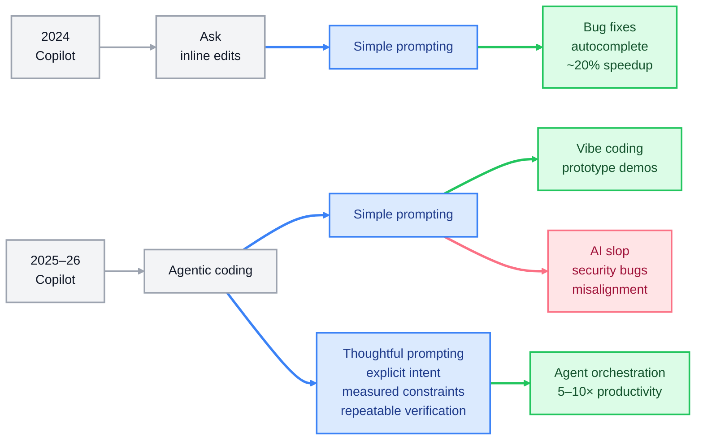
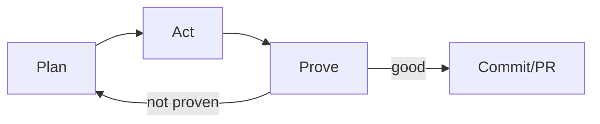
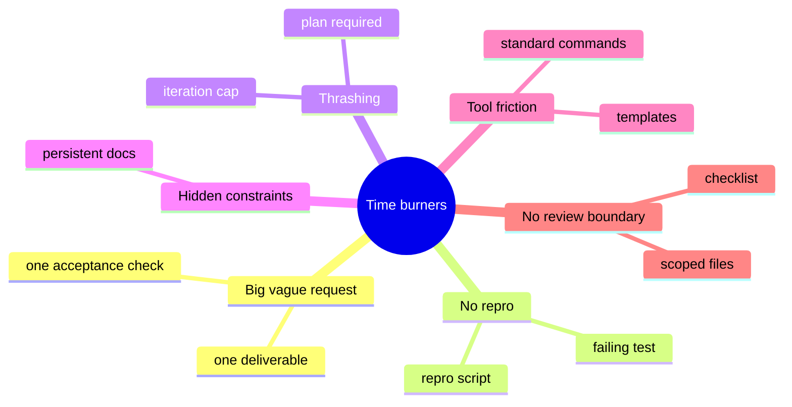
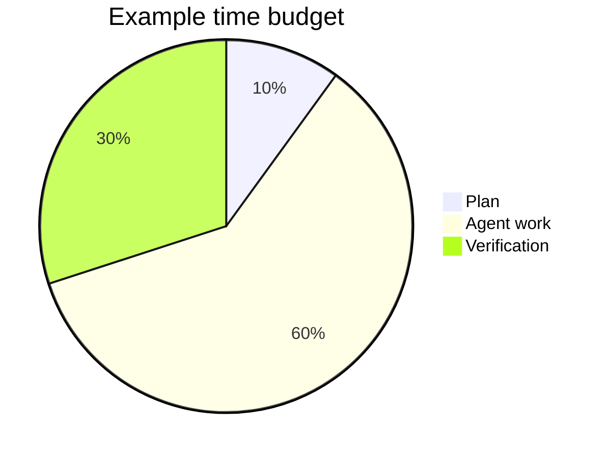
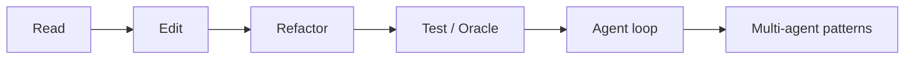
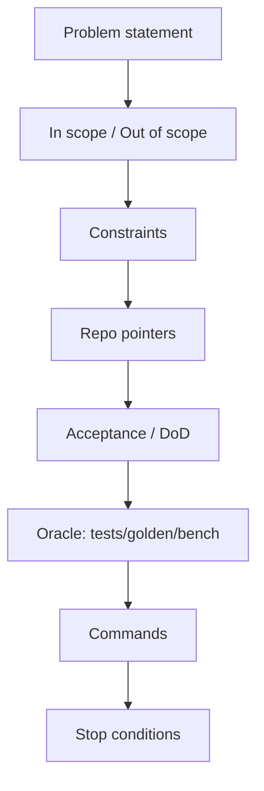
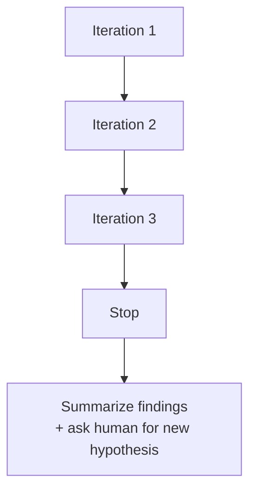
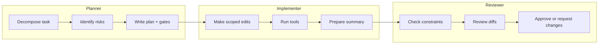
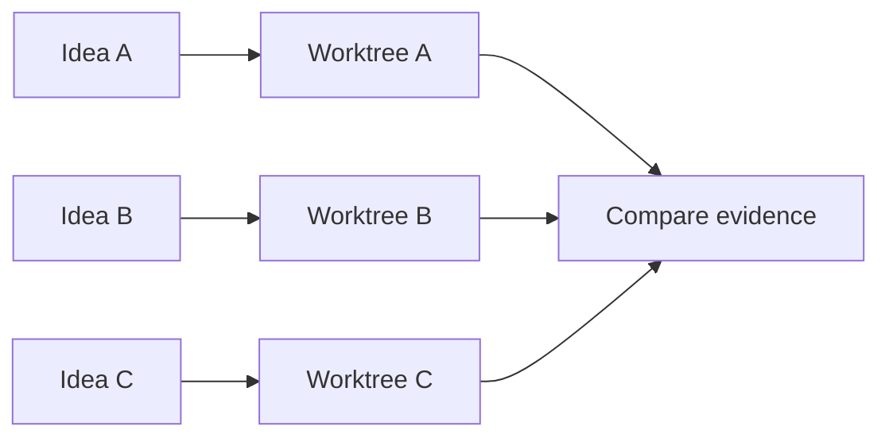

# Slide 1 — The 2025 Shift
## Typing Faster → Delegating Work

- 2024: AI helped you write *lines*
- 2025: AI helps move *work* across the lifecycle
- You still own intent, constraints, and review

```mermaid
flowchart LR
  %% Use <br/> for reliable line breaks in Mermaid node labels.
  %% Aim: show the 2024 baseline, then the 2025 fork: bad "vibe/slop" vs good "ICV → agents".

  A2024["2024<br/>Copilot"] --> CPT24["Ask<br/>inline edits"]
  CPT24 --> SP24["Simple prompting"]
  SP24 --> OUTGOOD24["Bug fixes<br/>autocomplete<br/>~20% speedup"]

  A2025["2025–26<br/>Copilot"] --> AG25["Agentic coding"]

  AG25 --> SP25["Simple prompting"]
  SP25 --> OUTGOOD25A["Vibe coding<br/>prototype demos"]
  SP25 --> OUTBAD25["AI slop<br/>security bugs<br/>misalignment"]

  AG25 --> TP25["Thoughtful prompting<br/>explicit intent<br/>measured constraints<br/>repeatable verification"]
  TP25 --> OUTGOOD25B["Agent orchestration<br/>5–10× productivity"]

  classDef neutral fill:#f3f4f6,stroke:#9ca3af,stroke-width:2px,color:#111827
  classDef decision fill:#dbeafe,stroke:#3b82f6,stroke-width:2px,color:#1e3a8a
  classDef bad fill:#ffe4e6,stroke:#fb7185,stroke-width:2px,color:#9f1239
  classDef good fill:#dcfce7,stroke:#22c55e,stroke-width:2px,color:#14532d

  class A2024,A2025,CPT24,AG25 neutral
  class SP24,SP25,TP25 decision
  class OUTBAD25 bad
  class OUTGOOD24,OUTGOOD25A,OUTGOOD25B good

  %% Link coloring by edge index (in order of appearance of --> lines):
  %% 0 A2024->CPT24
  %% 1 CPT24->SP24
  %% 2 SP24->OUTGOOD24
  %% 3 A2025->AG25
  %% 4 AG25->SP25
  %% 5 SP25->OUTGOOD25A
  %% 6 SP25->OUTBAD25
  %% 7 AG25->TP25
  %% 8 TP25->OUTGOOD25B
  linkStyle 0,3 stroke:#9ca3af,stroke-width:2px
  linkStyle 1,4,7 stroke:#3b82f6,stroke-width:3px
  linkStyle 6 stroke:#fb7185,stroke-width:3px
  linkStyle 2,5,8 stroke:#22c55e,stroke-width:3px

```

> But if you don't give good guidance you have a  drunken robot 🍺🤖🍺 playing with your code.

<!-- _notes:
Purpose: Reset expectations; reduce hype; validate skepticism.
Emphasize: "Don’t build features. Build the system that builds features."
-->

---

# Slide 2 — Agents are stupid geniuses
> “Eager junior with superpowers”

| The good | The bad and the ugly |
|---|---|
| <ul><li>reason about a goal</li><li>plan steps</li><li>take actions (read code, propose edits, run tools)</li><li>iterate until the goal is met (or it gets stuck)</li></ul> | <ul><li>Confidently wrong / plausible nonsense</li><li>Missing hidden constraints (legacy quirks, performance, real-time, encoding)</li><li>Over-generalizing “best practices” into the wrong environment</li><li>Thrashing: tries multiple random changes without a stable hypothesis</li><li>Tool misuse: wrong commands, wrong environment assumptions, partial runs</li></ul> |

| | **Risk: Low** | **Risk: High** |
|---|---|---|
| **Ambiguity: Low** | Great for agents (docs, refactors, small tests) | Needs gates + review (small but critical changes) |
| **Ambiguity: High** | Clarify first (spec + oracle) | Human-first (architecture/safety-critical/unclear bugs) |

<!-- _notes:
Make it safe: “If you tried once and it wasted time, that’s a predictable failure mode.”
-->

---

# Slide 3 — Context Engineering
## Orientation • Tools • Objectives

- Most failures are **context** failures
- Competitive advantage: make intent + constraints + verification explicit

| | Orientation | Tools | Objectives |
|---|---|---|---|
| examples | repo instructions per-job instructions Copilot Chat custom agents | Context7 (API truth) git/GitHub Serena (search/refactor) | OpenSpec Spec Kit Jira + Markdown specs |
| without it | fights codebase makes it worse | no proof no confidence | plausible code wrong requirements |
| with it | changes match local norms less rework | you can verify locally repeatable evidence | “done” is measurable clear success/failure |

<!-- _notes:
Explain the triangle as an investment: assets you maintain, not a one-time prompt.
Copilot-specific: encourage a “project briefing” habit.
-->

---

# Slide 4A — Daily Workflow
## Single prompt vs Agent loop vs Human-first

```mermaid
flowchart TD
  S[Start] --> Q1{Understand the task?}
  Q1 -- No --> D1[Define smallest deliverable
+ constraints + acceptance check]
  D1 --> Q2
  Q1 -- Yes --> Q2{High risk?}

  Q2 -- Yes --> G[Add gates:
plan → diff → tests → checklist]
  Q2 -- No --> Q3
  G --> Q3{Have an oracle?}

  Q3 -- No --> O[First: create the oracle
(failing test/repro/baseline)]
  O --> M
  Q3 -- Yes --> M{Choose mode}

  M -->|Single prompt| SP[Fast Q&A / one-file]
  M -->|Agent loop| AL[Multi-step work]
  M -->|Human-first| HF[Architecture / safety / ambiguity]

  SP --> P[Always end with: Prove it]
  AL --> P
  HF --> P
```

<!-- _notes:
Emphasize: agentic coding is not fewer steps; it’s different steps.
-->

---

# Slide 4B — The Mode Selector (Compact)

1) Small, clear, one file? → **Single prompt**
2) Multi-file or needs tests? → **Agent loop**
3) High risk or unclear requirements? → **Human-first**

**Visual direction:** three “exit ramps” with a shared rule at the bottom: **PROVE IT**.

<!-- _notes:
Use this when you want a simpler on-screen slide and talk through the details.
-->

---

# Slide 4C — The Non‑Negotiable Loop
## Plan → Act → Prove

```mermaid
flowchart LR
  P[Plan] --> A[Act]
  A --> V[Prove]
  V -->|good| C[Commit/PR]
  V -->|not proven| P
```

- “Prove it” = tests, diffs, benchmark, trace, regression report

<!-- _notes:
Tie to your environment: pick 1–2 concrete proof artifacts you’ll expect every time.
-->

---

# Slide 5A — Stop Burning Time
## 6 failure patterns → replacement habits

| Anti-pattern | Replacement habit |
|---|---|
| Big vague request | One deliverable + one acceptance test |
| No local reproduction | Write a repro script / failing test |
| Agent thrashing | Require a plan; cap iterations |
| Hidden constraints | Put constraints in a persistent place |
| Tool friction | Standardize commands + templates |
| No review boundary | Allowed files + checklist + diff review |

<!-- _notes:
Read 1–2 rows slowly; let the audience self-diagnose.
-->

---

# Slide 5B — Failure Patterns (Visual)

```mermaid
mindmap
  root((Time burners))
    Big vague request
      one deliverable
      one acceptance check
    No repro
      failing test
      repro script
    Thrashing
      plan required
      iteration cap
    Hidden constraints
      persistent docs
    Tool friction
      standard commands
      templates
    No review boundary
      scoped files
      checklist
```

<!-- _notes:
Optional script: “Before you write code, ask: what info do you need to avoid guessing?”
-->

---

# Slide 5C — Time Budget (Example)
## Spend time where it reduces risk

```mermaid
pie title Example time budget
  "Plan" : 10
  "Agent work" : 60
  "Verification" : 30
```

- If verification is 0%, you’re gambling

<!-- _notes:
Clarify: percentages are illustrative, not a rule.
-->

---

# Slide 6A — Retraining Plan (2 Weeks)
## Build trust by building oracles

```mermaid
flowchart LR
  R[Read] --> E[Edit]
  E --> RF[Refactor]
  RF --> T[Test / Oracle]
  T --> AL[Agent loop]
  AL --> MA[Multi-agent patterns]
```

- Goal: trust your **verification**, not the agent

<!-- _notes:
Anchor: Week 1 is mechanics + trust; Week 2 is controlled loops.
-->

---

# Slide 6B — Week-by-Week (On Screen)

| Week 1 (low risk, high feedback) | Week 2 (controlled loops) |
|---|---|
| Read & summarize modules | Scoped tickets |
| One-file improvements | Plan + evidence gates |
| Build the oracle | Risks & assumptions note |

**Image direction:** a 2-week ladder with “oracle” as the hinge between weeks.

<!-- _notes:
If your audience includes skeptics: emphasize “trust-building” via repeatable checks.
-->

---

# Slide 6C — Role-Based Entry Points

| Role | Good starter tasks |
|---|---|
| Interns | docs + tests + small refactors |
| Test techs | triage scripts + log parsing |
| Embedded/firmware | simulator assertions + state-machine tests |
| DevOps/SRE | runbook updates + rollout/rollback |
| AppSec | minimal patches + regression tests |
| Data/ML | schema checks + eval harnesses |
| HPC/simulation | golden output + perf baselines |

<!-- _notes:
Pick 2–3 roles present in the room and call them out explicitly.
-->

---

# Slide A1A — Task Spec Template
## Turn vague work into agent-executable work

- Problem (2–3 sentences)
- Scope / non-goals
- Constraints (perf/memory/timing/safety)
- Acceptance + oracle
- Commands + stop conditions

**Visual direction:** show the template as a one-page form.

<!-- _notes:
This slide is a “tool”: tell people to copy/paste it.
-->

---

# Slide A1B — Task Spec (As a Checklist)

```mermaid
flowchart TD
  P[Problem statement] --> S[In scope / Out of scope]
  S --> C[Constraints]
  C --> R[Repo pointers]
  R --> A[Acceptance / DoD]
  A --> O[Oracle: tests/golden/bench]
  O --> K[Commands]
  K --> X[Stop conditions]
```

- If any box is missing, expect guessing

<!-- _notes:
Teach the habit: “If we don’t write it down, the agent will invent it.”
-->

---

# Slide A1C — Filled Mini-Example (Legacy-ish)

- **Problem:** intermittent parse failure with mixed encodings
- **Constraints:** no new deps; throughput within 5% baseline
- **DoD:** add corpus + unit test + perf proof + doc note

**Image direction:** a small “ticket card” with these fields filled in.

<!-- _notes:
This is your concrete example—keep it short, realistic, and slightly painful.
-->

---

# Slide A2A — Rules of Engagement
## Reduce risk + increase repeatability

| Agent may do | Agent may NOT do (without permission) |
|---|---|
| propose plan | change pipelines / security settings |
| scoped edits | refactor cross-cutting architecture |
| add/modify tests | safety-critical logic changes |
| write docs | commit secrets / customer data |

<!-- _notes:
Point out: permissions aren’t about distrust—they’re about blast radius control.
-->

---

# Slide A2B — Evidence Required Before Merge

- Tests green (name them)
- Lint/format passes
- Benchmarks/sim outputs (if relevant)
- “What changed” + risks/assumptions

**Visual direction:** a pre-merge checklist with an “evidence” column.

<!-- _notes:
Tie to the earlier “prove it” mantra.
-->

---

# Slide A2C — Escalation Rule
## If 3 iterations fail: stop

```mermaid
flowchart TD
  I[Iteration 1] --> J[Iteration 2] --> K[Iteration 3]
  K --> S[Stop]
  S --> Z[Summarize findings
+ ask human for new hypothesis]
```

- Prevents thrash loops and sunk time

<!-- _notes:
Make it explicit: stopping is a success condition, not a failure.
-->

---

# Slide A3A — Multi-Agent Pattern (Swim Diagram)

```mermaid
flowchart LR
  subgraph P[Planner]
    P1[Decompose task] --> P2[Identify risks] --> P3[Write plan + gates]
  end

  subgraph I[Implementer]
    I1[Make scoped edits] --> I2[Run tools] --> I3[Prepare summary]
  end

  subgraph R[Reviewer]
    R1[Check constraints] --> R2[Review diffs] --> R3[Approve or request changes]
  end

  P3 --> I1
  I3 --> R1
```

<!-- _notes:
Emphasize separation of concerns and passing artifacts (plan, diffs, evidence).
-->

---

# Slide A3B — When Multi-Agent Helps

| Situation | Pattern |
|---|---|
| Need parallel research | split agents by docs/legacy/tests |
| Big ticket, high risk | planner → implementer → reviewer |
| Flaky tests / unknown history | dedicated “investigator” agent |

**Image direction:** three lanes with artifacts passed between them.

<!-- _notes:
Keep this optional—frame as “what’s next” not required for day 1.
-->

---

# Slide A3C — Practical Tip: Parallel Experiments

- Use separate working dirs (e.g., git worktrees)
- Use async/long-running tasks for big matrices

```mermaid
flowchart LR
  A[Idea A] --> WA[Worktree A]
  B[Idea B] --> WB[Worktree B]
  C[Idea C] --> WC[Worktree C]
  WA --> R[Compare evidence]
  WB --> R
  WC --> R
```

<!-- _notes:
Only include if your audience will actually do parallel experiments.
-->
